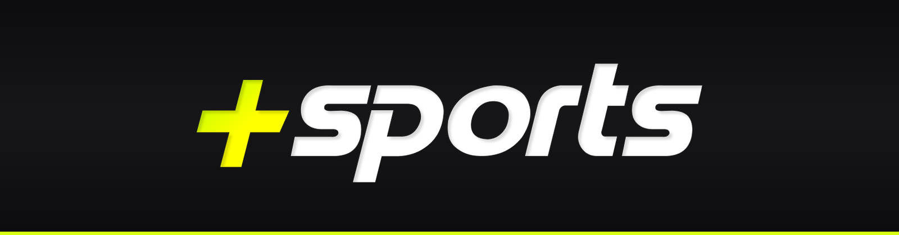
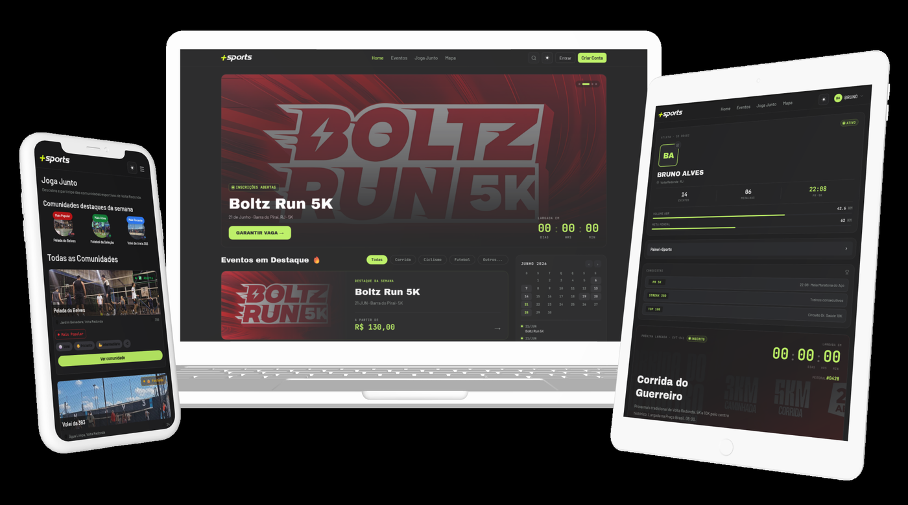

  

<!-- 

  Conectando praticantes de esportes aos espaços públicos da cidade.

 -->

  
  
  
  
  

<!-- --- -->

## 📌 Sobre o projeto

O **+Sports** é uma aplicação Web que conecta a comunidade aos espaços esportivos públicos da cidade, facilitando tanto a localização de quadras e praças disponíveis quanto a organização de partidas, treinos e eventos esportivos entre os próprios moradores. A proposta nasceu da dificuldade de encontrar informações sobre a infraestrutura esportiva local e de montar grupos para a prática de atividades físicas, que hoje depende quase inteiramente do boca a boca.

O projeto foi desenvolvido como trabalho acadêmico do curso de **Sistemas de Informação (UniFOA)**, seguindo a metodologia de Design Thinking, com etapas de pesquisa com usuários reais e testes de usabilidade.

🔗 **Demo online:** [Versão 2.0 - 2026.1](https://gabriel-lorenasi.github.io/maissports2.0/index.html)

## 🖥️ Preview

  

## ⚙️ Funcionalidades principais

- 🗺️ **Mapa interativo** de quadras e espaços esportivos públicos, com filtros por modalidade e status
- 🏃 **Eventos esportivos** — inscrição, controle de vagas por lote e acompanhamento em "Meus Eventos"
- 🤝 **Joga Junto** — organização de partidas informais e confirmação de presença entre a comunidade
- 👤 **Perfis personalizados**, com histórico de atividades, conquistas e comunidades favoritas
- 🔐 **Autenticação** com perfis distintos para atleta, organizador de eventos e administrador

## 🛠️ Tecnologias utilizadas

Por se tratar, na fase atual, de uma aplicação inteiramente front-end:

| Tecnologia | Uso no projeto |
|---|---|
| **HTML5** | Estruturação semântica das páginas |
| **Tailwind CSS v4** (via Play CDN) | Estilização e layout responsivo |
| **CSS3** | Animações e microinterações |
| **JavaScript (ES6+)** | Mapa customizado, cronômetros, controle de sessão, etc... |
| **Figma** | Prototipagem |
| **Git & GitHub** | Versionamento e trabalho colaborativo |
| **GitHub Pages** | Hospedagem e publicação do site |

## 👥 Equipe

| Integrante |
|---|
| Júlio Cezar Barbosa de Souza |
| Gustavo Eduardo Silva |
| Davi Pereira Ramos | 
| Gabriel da Silva Lorena | 
| Vinicius Machado Robles de Santi | 

## 📄 Licença

Este projeto está sob os termos definidos no arquivo [LICENSE](./LICENSE).
